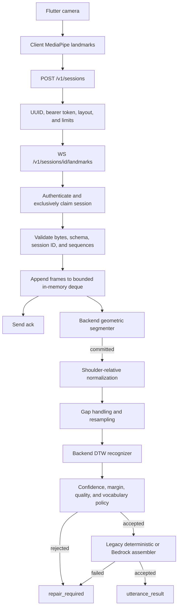
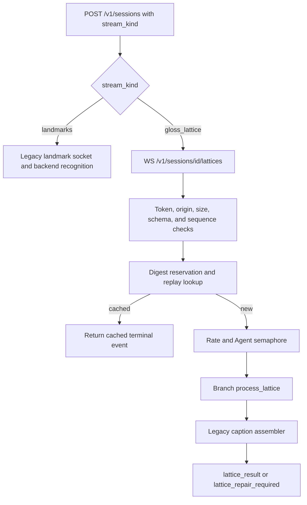
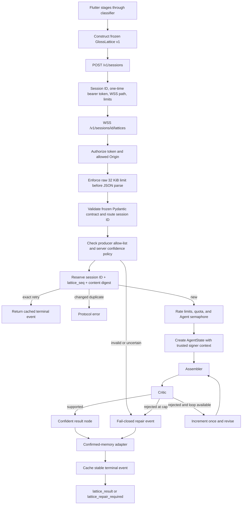
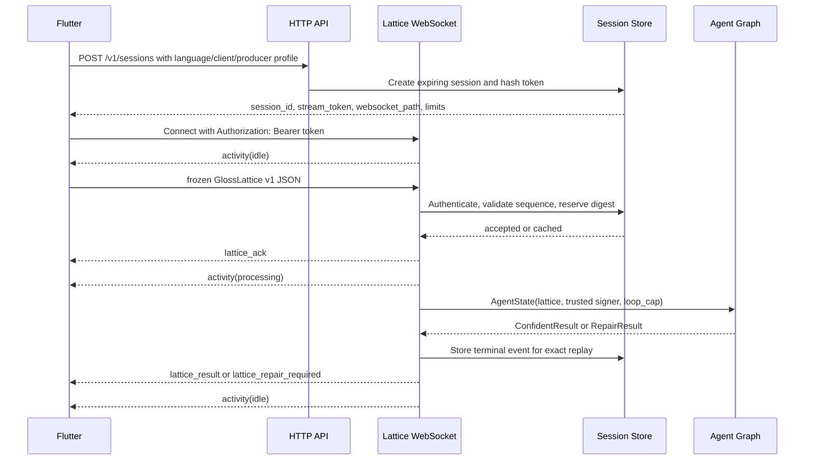

**BACKEND RECOVERY, SCHEMA, AND GLOSSLATTICE MIGRATION TODO**


# METADATA
<details>
<summary>Local status, evidence snapshot, and usage instructions.</summary>

| Field                   | Value                                                        |
| :---------------------- | :----------------------------------------------------------- |
| **Code**                | `BTD` — local working note; deliberately unregistered        |
| **Status**              | Draft                                                        |
| **Last reviewed**       | 2026-09-06                                                   |
| **Source of truth for** | Nothing; implementation and frozen contracts override it     |
| **Current backend**     | `origin/backend` at `f3fdec7`                                |
| **Contract branch**     | `origin/front_back_contract` at `71e9d7a`                    |
| **Contract authority**  | `plan/CTR_contracts.md` and `contracts/gloss_lattice.py`      |

**For the team.** This is a local recovery and migration checklist. It is intentionally named
`plan/backend-todo.md` as requested, is not registered in `ref_index.md`, and must not be
committed. Add `/plan/backend-todo.md` to `.git/info/exclude` on this machine and verify the staged
file list before every commit.

**For the assistant.** Update this file only when explicitly requested. Do not register, stage,
commit, or push it. Re-run every diagnostic before changing a checked item because this snapshot
describes the repository on 2026-09-06.

</details>

---


# 1. EXECUTIVE DIAGNOSIS
## 1.1. Current State
The backend is not ready to install or connect to the intended frontend for four independent
reasons.

1. **The only local virtual environment is invalid.** `.venv-py39` uses Python 3.9.6, while
   `pyproject.toml` requires Python `>=3.11,<3.14`. It has no application dependencies and its
   activation and `pip` scripts still point to a nonexistent directory named `.venv`.
2. **The invalid environment is committed.** Git tracks 570 files under `.venv-py39`, occupying
   about 8.9 MB locally. The current `.gitignore` ignores `.venv/`, but not `.venv-py39/`.
3. **The live server still accepts landmarks.** `origin/backend` registers only
   `/v1/sessions/{session_id}/landmarks`. Its reachable runtime performs backend segmentation,
   normalization, recognition, confidence gating, and legacy caption assembly.
4. **The intended lattice and Agent path is dormant.** The same branch contains the frozen
   `GlossLattice` v1 model and the newer assembler, critic, repair, adapter, tools, and bounded
   LangGraph, but FastAPI and the runtime do not call them.

No current test result can be claimed. Python 3.12 is installed, but none of the runtime or
development packages is installed into it.


## 1.2. Required Target
The target is one **GlossLattice-only** backend:

```text
Flutter / Android owns                     Hosted Python backend owns
────────────────────────────────────       ──────────────────────────────────
camera                                     session authentication
subject tracking                          GlossLattice validation
landmark extraction                       sequence/idempotency/rate controls
tracking state                             server-side confidence recheck
normalization                             bounded assembler Agent
segmentation                              critic Agent
classifier + calibration                  repair decision
GlossLattice construction          ───►   confirmed-memory adapter
                                           caption / TTS or repair event
```

The backend must never accept raw video, landmark arrays, feature tensors, or a client-supplied
signer identity after this migration.


## 1.3. Merge Rule
Do **not** merge or cherry-pick `71e9d7a` wholesale. The safe integration rule is:

1. Start from `origin/backend`, which contains the current Agent implementation.
2. Preserve the frozen `GlossLattice` in `src/simplynext/contracts/gloss_lattice.py`.
3. Port the transport safety mechanisms from `origin/front_back_contract`.
4. Adapt those mechanisms to the frozen contract instead of importing that branch's incompatible
   `src/simplynext/contracts/lattices.py`.
5. Add and verify the lattice path alongside the landmark path temporarily.
6. Delete the landmark path only after the lattice vertical slice passes locally and from Android.

This order keeps a recoverable, testable backend throughout the migration.

---


# 2. VIRTUAL ENVIRONMENT RECOVERY
## 2.1. Observed Evidence
1. **Shell interpreter.** `python` is not available before activation. `/usr/bin/python3` is
   Python 3.9.6 and is unsuitable for this project.
2. **Suitable interpreter.** `/opt/homebrew/bin/python3.12` is Python 3.12.14 and satisfies the
   project constraint.
3. **Missing canonical environment.** `.venv/` does not exist.
4. **Invalid old environment.** `.venv-py39/pyvenv.cfg` reports Python 3.9.6 and points to Apple
   Command Line Tools Python.
5. **Broken generated paths.** `.venv-py39/bin/activate` sets `VIRTUAL_ENV` to
   `.../SimplyNext/.venv`, while `.venv-py39/bin/pip` has a shebang pointing to
   `.../SimplyNext/.venv/bin/python3`. The environment was apparently renamed after creation.
6. **No dependencies.** The old environment contains only `pip==21.2.4` and
   `setuptools==58.0.4`; `import simplynext` fails.
7. **No global fallback.** Python 3.12 cannot import `boto3`, `fastapi`, `langgraph`, `numpy`,
   `pydantic`, `pydantic_settings`, `uvicorn`, or the development tools.
8. **Missing configuration.** `.env` is absent; only `.env.example` exists.
9. **Missing lock and deployment artifacts.** No lock file, Dockerfile, Procfile, platform
   manifest, or CI workflow exists.

> **Warning:** A successful `pip check` inside `.venv-py39` would only prove that its two bootstrap
> packages do not conflict. It would not prove that the backend is installed.


## 2.2. Dependency Ownership
`pyproject.toml` is authoritative.

1. **Python:** `>=3.11,<3.14`; Python 3.12 is the project baseline.
2. **Build backend:** `hatchling>=1.26,<2`.
3. **Runtime:** `boto3`, `fastapi`, `langgraph==1.2.11`, `numpy`, `pydantic`,
   `pydantic-settings`, and `uvicorn`.
4. **Development:** `httpx`, `mypy`, `pytest`, `pytest-asyncio`, and `ruff`.
5. **Installed package name:** `simplynext-backend`.
6. **Installed console command:** `simplynext-api`.
7. **`requirements.txt`:** contains only `-e .`; it is an editable-install entry point, not a
   lock file.

`mediapipe`, `pose-format`, and `spoken-to-signed` are planned dependencies only. A
GlossLattice-only server should not install MediaPipe or `pose-format`; perception and
classification are frontend responsibilities in the target architecture.


## 2.3. Protect This Local File
Perform this once in the local repository's `.git/info/exclude` file:

```text
/plan/backend-todo.md
```

Do not add the path to the shared `.gitignore`. Before every commit, run:

```bash
git status --short
git diff --cached --name-only
```

`plan/backend-todo.md` must appear in neither the staged list nor a commit.


## 2.4. Create the Correct Environment
Run from the repository root:

```bash
cd /Users/nc.mhoang/Work/SimplifyNext/SimplyNext
pwd
deactivate 2>/dev/null || true
hash -r
/opt/homebrew/bin/python3.12 --version
/opt/homebrew/bin/python3.12 -m venv .venv
source .venv/bin/activate
```

Verify the interpreter boundary before installing anything:

```bash
python --version
command -v python
python -m pip --version
python -c "import sys; print(sys.executable); print(sys.prefix); print(sys.base_prefix)"
```

Expected evidence:

- `python --version` reports Python 3.12.x.
- `command -v python` ends in `SimplyNext/.venv/bin/python`.
- `python -m pip --version` names `.venv` and Python 3.12.
- `sys.prefix` and `sys.base_prefix` differ.

Never rename or copy `.venv`; recreate it from `pyproject.toml` when necessary.


## 2.5. Install the Development Environment
Use the interpreter-bound `pip` form throughout:

```bash
python -m pip install --upgrade pip
python -m pip install -e '.[dev]'
```

The quotes around `.[dev]` are required in zsh. Do not use `sudo pip` and do not install planned
perception packages ad hoc.

Verify the installation:

```bash
python -m pip check
python -m pip show simplynext-backend
python -c "import boto3, fastapi, langgraph, numpy, pydantic, pydantic_settings, uvicorn"
python -c "import httpx, pytest, pytest_asyncio"
```

Run all repository gates:

```bash
python -m pytest
python -m ruff check src tests main.py
python -m mypy src
```

There are currently 148 explicitly declared test functions before parameter expansion. A failed
gate must be investigated; it must not be bypassed merely to reach deployment.


## 2.6. Configure and Start the Existing Backend
Create a local, ignored configuration and keep Bedrock disabled initially:

```bash
cp .env.example .env
python main.py
```

The installed alternative is:

```bash
simplynext-api
```

Check it from another terminal:

```bash
curl -i http://127.0.0.1:8000/healthz
curl -i http://127.0.0.1:8000/readyz
```

`/healthz` should return `200` when the process is alive. On the current backend, `/readyz` is
expected to return `503` until both a calibrated recognizer and caption assembler are configured.
That is a readiness/configuration result, not a virtual-environment failure.


## 2.7. Remove the Committed Python 3.9 Environment
This is a repository cleanup change, separate from the local `.venv` and from this uncommitted
document. Validate the exact target first:

```bash
pwd
git ls-files -- .venv-py39 | wc -l
sed -n '1,20p' .venv-py39/pyvenv.cfg
```

The expected count is 570 and the expected version is 3.9.6. Then, on a dedicated cleanup branch:

```bash
git rm -r -- .venv-py39
```

Update the shared `.gitignore` from an exact `.venv/` rule to a root-scoped `/.venv*/` rule, then
verify both names:

```bash
git check-ignore -v .venv .venv-py39
git diff --cached --stat
git diff --cached --name-only | rg '^plan/backend-todo\.md$' && echo 'STOP: local todo staged'
```

The final command must print nothing. Never run `git rm` against the new `.venv/`.


## 2.8. Troubleshooting
1. **`python: command not found`.** No correct environment is active. Create it with the absolute
   Python 3.12 path, then source `.venv/bin/activate`.
2. **Python reports 3.9.6.** The Apple system interpreter or `.venv-py39` was selected. Deactivate,
   clear the shell command cache with `hash -r`, and activate `.venv`.
3. **`bad interpreter: .../.venv/bin/python3`.** A command came from the renamed
   `.venv-py39`. Do not repair generated scripts; remove and recreate the environment.
4. **`zsh: no matches found: .[dev]`.** The extras expression was unquoted. Use
   `python -m pip install -e '.[dev]'`.
5. **`externally-managed-environment`.** Installation is targeting Homebrew or system Python
   instead of `.venv`. Confirm that `sys.prefix != sys.base_prefix`.
6. **`ModuleNotFoundError: uvicorn` or another project dependency.** Confirm that `python` and
   `python -m pip` resolve inside the same `.venv`, then repeat the editable development install.
7. **Tests cannot import `simplynext`.** The editable package is missing or the wrong interpreter
   is running pytest. Use `python -m pytest`, never a bare `pytest` from an unknown path.
8. **Dependency resolver failure.** Capture the complete first error. Recreate `.venv` with
   Python 3.12 before changing declared versions. Do not solve it with unrecorded one-off pins.
9. **TLS/certificate failure during installation.** Configure the organization proxy or trusted
   certificate. Do not disable TLS verification.
10. **`/readyz` returns `503`.** Inspect its JSON body. The current landmark backend reports an
    unconfigured recognizer/assembler; the target lattice backend must report Agent readiness
    instead.
11. **Bedrock error during basic local work.** Set `SIMPLYNEXT_BEDROCK_ENABLED=false` and restart.
12. **Port 8000 is occupied.** Inspect it with
    `lsof -nP -iTCP:8000 -sTCP:LISTEN`, then stop the intended process or configure another port.

---


# 3. BACKEND SCHEMA REPORT
## 3.1. Branch Relationship
The two relevant tips share the earlier backend commit `aeea477` but then diverge.

1. **`origin/backend` at `f3fdec7`.** Contains the landmark runtime, frozen current
   `GlossLattice`, and the latest Stage 6–10 Agent code. It has no lattice WebSocket.
2. **`origin/front_back_contract` at `71e9d7a`.** Contains an earlier dual-mode backend with
   `/landmarks` and `/lattices`, plus robust lattice transport controls. It lacks the latest
   LangGraph Agent implementation.
3. **Critical collision.** Both branches define different payloads named `GlossLattice` with
   `schema_version: "1.0"`. A payload valid for one fails against the other.

The frozen authority in the current repository is `plan/CTR_contracts.md`, implemented by
`src/simplynext/contracts/gloss_lattice.py` and represented by
`tests/fixtures/gloss_lattice_v1.json`.


## 3.2. Current Landmark-Stream Folder Structure
```text
SimplyNext/
├── main.py                         compatibility launcher
├── pyproject.toml                  package, dependencies, and tool settings
├── requirements.txt               editable runtime installation entry
├── .env.example                    non-secret configuration template
├── data/
│   └── caption_templates.example.json
├── src/simplynext/
│   ├── main.py                     FastAPI factory and Uvicorn runner
│   ├── config.py                   SIMPLYNEXT_* settings
│   ├── runtime.py                  process-local service container
│   ├── orchestrator.py             reachable legacy translation pipeline
│   ├── api/
│   │   ├── routes.py               HTTP routes
│   │   ├── websocket.py            landmark/control WebSocket
│   │   └── middleware.py           HTTP request-size limit
│   ├── contracts/
│   │   ├── common.py               strict shared types
│   │   ├── landmarks.py            layout, frame, and batch schemas
│   │   ├── sessions.py             landmark negotiation and controls
│   │   ├── utterances.py           development hypothesis-replay schemas
│   │   ├── events.py               landmark-pipeline outbound events
│   │   └── gloss_lattice.py        frozen lattice v1; currently unreachable
│   ├── sessions/
│   │   └── store.py                bounded in-memory landmark sessions
│   ├── pipeline/
│   │   ├── segmentation.py         geometric/hysteresis segmentation
│   │   └── normalization.py        body-relative features and resampling
│   ├── recognition/
│   │   ├── types.py                recognition candidates and metadata
│   │   ├── recognizer.py           interface and unconfigured recognizer
│   │   ├── dtw.py                  template-bundle DTW recognizer
│   │   └── policy.py               confidence and quality gates
│   ├── agent/
│   │   ├── state.py                dormant lattice graph state
│   │   ├── graph.py                dormant bounded LangGraph
│   │   ├── assembler.py            old and new assembler code
│   │   ├── critic.py               dormant lattice critic
│   │   ├── repair.py               dormant deterministic repair
│   │   ├── adapter.py              dormant confirmed-memory adapter
│   │   ├── bedrock.py              reachable legacy Bedrock caption path
│   │   ├── bedrock_access.py       access preflight, usage, and spend guard
│   │   ├── tools/
│   │   └── prompts/
│   └── observability/
│       ├── logging.py              structured payload-free logging
│       └── metrics.py              process-local counters and timings
└── tests/                           contract, pipeline, Agent, and API tests
```


## 3.3. Current Landmark HTTP Routes
```text
GET       /                                      service/version pointer
GET       /healthz                               process liveness
GET       /readyz                                recognizer + assembler readiness
GET       /metrics                               process-local metrics
POST      /v1/sessions                           create ephemeral session/token
DELETE    /v1/sessions/{session_id}              authenticated deletion
POST      /v1/utterances                         optional development replay only
WebSocket /v1/sessions/{session_id}/landmarks    live landmark/control stream
GET       /docs                                  generated API documentation
GET       /openapi.json                          generated HTTP schema
```

`POST /v1/utterances` exists only when
`SIMPLYNEXT_ENABLE_HYPOTHESIS_REPLAY_ENDPOINT=true`. It is not an application traffic path.


## 3.4. Current Landmark Session Variables
The `POST /v1/sessions` request is:

```text
language                  "asl" | "sgsl"
schema_version            literal "1.0"
client.platform           "android" | "ios" | "test"
client.app_version        string, 1..64 characters
client.device_model       string or null, 1..128 characters when present
detector.name             string, 1..128 characters
detector.version          string, 1..64 characters
detector.delegate         "cpu" | "gpu" | "nnapi" | "core_ml" | "unknown"
```

The response is:

```text
session_id                UUID
stream_token              one-time bearer token, 32..256 characters
token_type                literal "Bearer"
websocket_path            relative /v1/.../landmarks path
created_at                timezone-aware timestamp
expires_at                timezone-aware timestamp
layout                    fixed landmark layout
max_batch_frames          negotiated store limit
target_fps                negotiated target frame rate
```


## 3.5. Current Landmark WebSocket Variables
The inbound `landmark_batch` fields are:

```text
type                      literal "landmark_batch"
schema_version            literal "1.0"
session_id                UUID; must match the authenticated route
batch_seq                 non-negative, monotonically increasing integer
camera.source_width       positive integer
camera.source_height      positive integer
camera.rotation_degrees   0 | 90 | 180 | 270
camera.mirrored_input     boolean
camera.coordinates_canonical literal true
frames                    1..32 LandmarkFrame values
dropped_before            non-negative integer
```

Each `LandmarkFrame` contains:

```text
seq
capture_ms
subject_id
pose
left_hand
right_hand
face
left_hand_score
right_hand_score
tracking_confidence
```

Each landmark point is `[x, y, z, confidence]`. The arrays are fixed at 21 points for each hand,
9 selected upper-body pose points, and 16 selected face points. Frame sequence and capture time
must increase. A hand score is invalid without the corresponding hand array.

The configured default store limit is 8 frames even though the contract permits up to 32. The
smaller negotiated limit wins.

The inbound `control` fields are:

```text
type                      literal "control"
session_id                UUID
control_seq               non-negative, monotonically increasing integer
action                    start | pause | resume | commit | end | ping | clear_live_data
client_ms                 optional non-negative integer
```

The server emits:

1. **`ack`:** `batch_seq`, `last_frame_seq`, `received_frames`, `buffered_frames`,
   `dropped_frames`, `server_ms`.
2. **`activity`:** `state`, `score`, `utterance_id`, `capture_ms`.
3. **`pong`:** `control_seq`, `server_ms`.
4. **`error`:** `code`, `message`, `retryable`, `batch_seq`.
5. **`utterance_result`:** `utterance_id`, `status`, `caption`, `tts_text`, `confidence`,
   `gloss_trace`, `hypotheses`, `model_version`, `latency_ms`.
6. **`repair_required`:** `utterance_id`, `status`, `action`, `message`, `confidence`, `choices`,
   `reason_codes`, `model_version`, `latency_ms`.

Error codes are `invalid_message`, `unauthorized`, `session_not_found`, `session_expired`,
`invalid_session_state`, `non_monotonic_sequence`, `batch_too_large`, `rate_limited`, and
`internal_error`. Three malformed messages close with `1008`; an oversized message closes with
`1009`.


## 3.6. Contract-Branch Folder Structure
`origin/front_back_contract` adds or modifies this lattice surface while retaining the entire
legacy landmark surface:

```text
docs/GLOSS_LATTICE_WEBSOCKET.md
src/simplynext/
├── main.py                         registers /landmarks and /lattices
├── config.py                       adds lattice rate/size/timeout settings
├── runtime.py                      adds a process semaphore
├── orchestrator.py                 adds process_lattice to the old engine
├── api/
│   └── lattice_websocket.py        authenticated lattice transport loop
├── contracts/
│   ├── lattices.py                 branch-specific, incompatible lattice v1
│   ├── sessions.py                 stream_kind negotiation
│   └── events.py                   lattice ack/result/repair events
└── sessions/
    └── store.py                    lattice reservation, digest, and replay cache

tests/
├── test_lattice_contracts.py
├── test_lattice_sessions.py
├── test_lattice_websocket.py
└── test_lattice_orchestrator.py
```

It adds:

```text
WebSocket /v1/sessions/{session_id}/lattices
```

The branch is **dual mode**, not lattice-only. `stream_kind` chooses `landmarks` or
`gloss_lattice`.


## 3.7. Contract-Branch GlossLattice Variables
The branch-specific envelope is:

```text
type                      literal "gloss_lattice"
schema_version            literal "1.0"
session_id                UUID
lattice_seq               0..2^53-1
utterance_id              Identifier
revision                  0..32
language                  "asl" | "sgsl"
subject_id                client-supplied Identifier
is_final                  boolean
capture_start_ms          0..2^53-1
capture_end_ms            greater than capture_start_ms
produced_ms               at or after capture_end_ms
producer                  nested producer descriptor
quality                   optional aggregate quality
slots                     1..32 slots
```

Its producer is:

```text
classifier.name
classifier.model_version
classifier.calibration_version
classifier.vocabulary_version
segmenter_version
top_k                     1..5
```

Its optional quality object is:

```text
observed_frames           1..100000
dropped_frames            0..100000
landmark_coverage         0.0..1.0
classifier_latency_ms     0..60000
```

Each slot is:

```text
slot_id
start_ms
end_ms
candidates[]              rank, gloss, confidence
resolved_gloss
selected_rank
provenance                classifier_high_confidence |
                          top_k_signer_confirmed |
                          fingerspelled |
                          unresolved
confirmed_at_ms
reason_codes[]
```

The branch permits up to 65,536 UTF-8 bytes, up to 32 slots, and overlapping slots ordered only by
start time.


## 3.8. Frozen Authoritative GlossLattice V1
The target ingress must preserve the current frozen contract exactly.

The envelope is:

```text
type                      literal "gloss_lattice"
schema_version            literal "1.0"
session_id                UUID
lattice_seq               strict integer, 0..2^53-1
utterance_id              Identifier
language                  "sgsl" | "asl"
timebase                  literal "session_monotonic_ms"
started_at_ms             strict integer, 0..2^53-1
ended_at_ms               strict integer, > started_at_ms
producer                  GlossLatticeProducer
slots                     1..64 GlossSlot objects
```

`GlossLatticeProducer` is:

```text
classifier_id
classifier_version
confidence_kind           literal "calibrated_probability"
calibration_version
vocabulary_version
```

Each `GlossSlot` is:

```text
slot_index                strict integer 0..63; equals its array position
slot_id                   unique Identifier
start_ms                  inside the utterance interval
end_ms                    inside the interval and > start_ms
candidates                0..5 GlossCandidate objects
resolved_gloss_id         Identifier or null
provenance                classifier_high_confidence |
                          top_k_signer_confirmed |
                          fingerspelled |
                          unresolved
```

Each `GlossCandidate` is:

```text
gloss_id                  Identifier
rank                      strict integer 1..5, contiguous from 1
confidence                strict finite float 0.0..1.0
```

Fixed rules:

1. Compact UTF-8 JSON is at most 32,768 bytes.
2. Identifiers contain 1–128 characters and match
   `^[A-Za-z0-9][A-Za-z0-9_.:-]*$`.
3. Unknown fields are rejected.
4. Numeric strings and booleans are not accepted as numbers.
5. Candidates are unique and ordered by non-increasing confidence.
6. Slots are unique, chronological, contiguous by `slot_index`, and non-overlapping.
7. `classifier_high_confidence` resolves to the rank-1 candidate.
8. `top_k_signer_confirmed` resolves to a retained candidate.
9. `fingerspelled` may resolve outside the retained candidate list.
10. `unresolved` requires `resolved_gloss_id: null`.
11. Signer identity is absent and comes only from trusted backend context.
12. Revision, quality, detector, landmark, and feature fields are absent from v1.

The frontend and backend must both accept the exact fixture at
`tests/fixtures/gloss_lattice_v1.json` before integration.


## 3.9. Incompatible Definitions Named V1
| Area             | `front_back_contract`                         | Frozen current v1                 |
| :--------------- | :-------------------------------------------- | :-------------------------------- |
| Module           | `contracts/lattices.py`                       | `contracts/gloss_lattice.py`      |
| Byte limit       | 65,536                                        | 32,768                            |
| Slot limit       | 32                                            | 64                                |
| Times            | `capture_start_ms`, `capture_end_ms`          | `started_at_ms`, `ended_at_ms`    |
| Candidate ID     | `gloss`                                       | `gloss_id`                        |
| Resolution       | `resolved_gloss`, `selected_rank`             | `resolved_gloss_id`               |
| Producer         | nested classifier + segmenter + `top_k`       | flat five-field descriptor        |
| Ordering         | overlap permitted                             | overlap rejected                  |
| Revision         | client `revision`                             | no revision field                 |
| Signer           | client `subject_id`                           | trusted backend context           |
| Optional extras  | `is_final`, `produced_ms`, `quality`          | none                              |

Do not combine these fields under version `1.0`. Features needed from the contract branch must be
represented in server-owned session state, outbound events, or a future explicitly versioned
contract.

There is also a smaller current mismatch: the wire `gloss_id` permits 128 characters, while the
Agent assembler's draft evidence currently limits the token to 64. The internal Agent constraint
must be widened to the frozen wire limit; the wire contract must not be narrowed silently.


## 3.10. Agent State Variables
The dormant current `AgentState` contains:

```text
lattice                   validated frozen GlossLattice
signer_id                 trusted backend identifier, never read from lattice JSON
adaptation_requests       explicitly signer-confirmed memory updates/deletions
conversation_history      reduced, ordered compact messages
signer_memory             reduced, signer-scoped confirmed entries
loop_count                starts at 0 and increments only at the retry node
loop_cap                  hard bounded; current maximum is one revision
```

`AgentGraphState` adds:

```text
draft
critique
result
outcome
node_path
run_record
```

The graph path is assembler → critic → confident or one revision → critic → repair, followed by
the adapter. The current unit-tested graph is not instantiated in `main.py` or
`orchestrator.py`.


## 3.11. Recommended Final Folder Structure
```text
src/simplynext/
├── main.py                         FastAPI factory and one-worker runner
├── config.py                       lattice, Agent, Bedrock, and server settings
├── runtime.py                      lattice session store + AgentGraph services
├── api/
│   ├── routes.py                   health/readiness/session routes
│   ├── lattice_websocket.py        only application WebSocket
│   └── middleware.py               request-size protection
├── contracts/
│   ├── common.py                   strict shared primitives
│   ├── gloss_lattice.py            unchanged frozen inbound v1
│   ├── sessions.py                 lattice-only negotiation
│   └── events.py                   lattice ack/result/repair events
├── sessions/
│   └── store.py                    token, sequence, replay, rate, and quota state
├── agent/
│   ├── state.py
│   ├── graph.py
│   ├── assembler.py
│   ├── critic.py
│   ├── repair.py
│   ├── adapter.py
│   ├── bedrock_access.py
│   ├── tools/
│   └── prompts/
└── observability/
    ├── logging.py
    └── metrics.py

tests/
├── fixtures/gloss_lattice_v1.json
├── contract tests
├── lattice session/WebSocket tests
├── Agent node/graph tests
├── transport safety tests
└── local end-to-end tests
```

The final production source must have no `pipeline/`, backend classifier, landmark contract, or
landmark socket.

---


# 4. WORKING PROCESSES
## 4.1. Current Reachable Landmark Process


The default recognizer is deliberately unconfigured. With no recognition bundle and no caption
templates, the current process fails closed rather than producing a caption.


## 4.2. Contract-Branch Dual Process


This branch has valuable transport behavior, but it neither removes the landmark path nor uses the
newer current `AgentGraph`.


## 4.3. Target GlossLattice-Only Process



## 4.4. Target Network Sequence


An exact retransmission must return the cached result without a second Agent or Bedrock run.

---


# 5. CONFIGURATION VARIABLES
## 5.1. Current Runtime Variables
All names are generated from `Settings` fields with the `SIMPLYNEXT_` prefix.

Runtime and HTTP:

```text
SIMPLYNEXT_APP_NAME
SIMPLYNEXT_ENVIRONMENT
SIMPLYNEXT_HOST
SIMPLYNEXT_PORT
SIMPLYNEXT_LOG_LEVEL
SIMPLYNEXT_API_PREFIX
SIMPLYNEXT_ALLOWED_ORIGINS
SIMPLYNEXT_SESSION_TTL_SECONDS
SIMPLYNEXT_MAX_ACTIVE_SESSIONS
SIMPLYNEXT_HTTP_MAX_BODY_BYTES
```

Legacy landmark transport:

```text
SIMPLYNEXT_TARGET_FPS
SIMPLYNEXT_MAX_BATCH_FRAMES
SIMPLYNEXT_MAX_QUEUED_FRAMES
SIMPLYNEXT_WEBSOCKET_MAX_MESSAGE_BYTES
```

Legacy server recognition and caption path:

```text
SIMPLYNEXT_RECOGNITION_LANGUAGE
SIMPLYNEXT_TEMPLATE_BUNDLE_PATH
SIMPLYNEXT_CAPTION_TEMPLATES_PATH
SIMPLYNEXT_MIN_RECOGNITION_CONFIDENCE
SIMPLYNEXT_MIN_RECOGNITION_MARGIN
SIMPLYNEXT_MIN_LANDMARK_COVERAGE
SIMPLYNEXT_ENABLE_HYPOTHESIS_REPLAY_ENDPOINT
```

Current Bedrock and cost controls:

```text
SIMPLYNEXT_BEDROCK_ENABLED
SIMPLYNEXT_BEDROCK_MODEL_ID
SIMPLYNEXT_AWS_REGION
SIMPLYNEXT_BEDROCK_LEASE_OWNER
SIMPLYNEXT_BEDROCK_SPEND_LIMIT_USD
SIMPLYNEXT_BEDROCK_KNOWN_SPEND_USD
SIMPLYNEXT_BEDROCK_INPUT_USD_PER_MILLION_TOKENS
SIMPLYNEXT_BEDROCK_OUTPUT_USD_PER_MILLION_TOKENS
SIMPLYNEXT_BEDROCK_CACHE_WRITE_USD_PER_MILLION_TOKENS
SIMPLYNEXT_BEDROCK_CACHE_READ_USD_PER_MILLION_TOKENS
SIMPLYNEXT_BEDROCK_PROMPT_CACHE_ENABLED
SIMPLYNEXT_AGENT_MAX_REVISIONS
```

AWS credentials are intentionally not `Settings` fields. Keep credentials out of `.env` and use
the standard AWS credential provider chain or a hosted workload role.


## 5.2. Lattice Controls to Port
Port these controls from `front_back_contract`, changing the branch's byte ceiling to the frozen
32 KiB limit:

```text
SIMPLYNEXT_GLOSS_LATTICE_MAX_MESSAGE_BYTES=32768
SIMPLYNEXT_MAX_LATTICES_PER_SESSION=100
SIMPLYNEXT_MAX_LATTICES_PER_MINUTE=30
SIMPLYNEXT_MAX_LATTICES_PER_MINUTE_GLOBAL=120
SIMPLYNEXT_MAX_CONCURRENT_AGENT_RUNS=4
SIMPLYNEXT_AGENT_QUEUE_TIMEOUT_SECONDS=2
SIMPLYNEXT_LATTICE_WEBSOCKET_IDLE_TIMEOUT_SECONDS=120
SIMPLYNEXT_BEDROCK_CONNECT_TIMEOUT_SECONDS=5
SIMPLYNEXT_BEDROCK_READ_TIMEOUT_SECONDS=30
SIMPLYNEXT_BEDROCK_TOTAL_MAX_ATTEMPTS=3
```

The target must also retain a server-side confidence threshold and top-1/top-2 margin check for
client classifier evidence. Existing names may be retained during migration:

```text
SIMPLYNEXT_MIN_RECOGNITION_CONFIDENCE=0.80
SIMPLYNEXT_MIN_RECOGNITION_MARGIN=0.15
SIMPLYNEXT_RECOGNITION_LANGUAGE=asl
```

The server must additionally compare `classifier_id`, `classifier_version`,
`calibration_version`, and `vocabulary_version` with an approved deployment profile. Session
negotiation alone is lineage, not proof that arbitrary client output is trusted.


## 5.3. Variables to Remove After Cutover
Remove these only after no production code or test references them:

```text
SIMPLYNEXT_TARGET_FPS
SIMPLYNEXT_MAX_BATCH_FRAMES
SIMPLYNEXT_MAX_QUEUED_FRAMES
SIMPLYNEXT_WEBSOCKET_MAX_MESSAGE_BYTES
SIMPLYNEXT_TEMPLATE_BUNDLE_PATH
SIMPLYNEXT_MIN_LANDMARK_COVERAGE
SIMPLYNEXT_ENABLE_HYPOTHESIS_REPLAY_ENDPOINT
```

`SIMPLYNEXT_CAPTION_TEMPLATES_PATH` may remain temporarily for a no-cost deterministic lattice
smoke path. Remove or rename it only after the target runtime has a deliberate replacement.


## 5.4. Important Configuration Traps
1. `.env.example` currently selects ASL, while the checked-in frozen lattice fixture selects SgSL.
   Local tests may use either, but a live session must match the deployment language.
2. Current startup performs a Bedrock control-plane preflight and a live runtime preflight when
   Bedrock is enabled. A restart can therefore invoke the model. Keep Bedrock disabled until the
   deterministic transport and Agent tests pass, then decide whether live preflight belongs in
   startup or in an explicit deployment smoke test.
3. `allowed_origins` is comma-separated. A browser `Origin` must match exactly. Native Android
   clients may omit `Origin`, but still require the bearer token.
4. Session, replay, rate, metrics, graph checkpoint, and spend-guard state is process-local. Keep
   one worker and one replica until shared atomic storage exists.

---


# 6. CHECKBOX MIGRATION PLAN
## 6.1. Phase 0 — Protect and Snapshot
- [ ] Add `/plan/backend-todo.md` to `.git/info/exclude` locally.
- [ ] Confirm `plan/backend-todo.md` is neither tracked nor staged.
- [ ] Fetch all remote branch tips without merging them.
- [ ] Confirm the intended base is `origin/backend` at or after `f3fdec7`.
- [ ] Create a recoverable backup branch/tag for the landmark backend.
- [ ] Create `integration/gloss-lattice-only` from `origin/backend`.
- [ ] Record the exact `origin/backend`, `origin/front_back_contract`, and frontend commit IDs.
- [ ] Keep unrelated frontend and documentation changes out of the backend migration commits.


## 6.2. Phase 1 — Repair the Development Environment
- [ ] Create `.venv` with `/opt/homebrew/bin/python3.12`; never reuse `.venv-py39`.
- [ ] Activate `.venv` and verify `sys.prefix != sys.base_prefix`.
- [ ] Install `-e '.[dev]'` with `python -m pip`.
- [ ] Run `pip check`, explicit imports, pytest, Ruff, and mypy.
- [ ] Copy `.env.example` to ignored `.env` and keep Bedrock disabled.
- [ ] Start the current server and verify `/healthz` independently of `/readyz`.
- [ ] Remove the 570 tracked `.venv-py39` files in a dedicated cleanup commit.
- [ ] Change `.gitignore` so every root `.venv*` directory is ignored.
- [ ] Verify a clean clone can create its own `.venv` and install from `pyproject.toml`.
- [ ] Produce a tested dependency lock or fully pinned production artifact.


## 6.3. Phase 2 — Freeze One Contract
- [ ] Declare `plan/CTR_contracts.md` authoritative for ingress v1.
- [ ] Keep `src/simplynext/contracts/gloss_lattice.py` rather than adding `lattices.py`.
- [ ] Keep `tests/fixtures/gloss_lattice_v1.json` as the cross-language golden fixture.
- [ ] Add a test that serializes and validates the fixture at exactly the 32,768-byte limit.
- [ ] Add a test that rejects every field unique to the incompatible branch v1.
- [ ] Widen the Agent draft-evidence gloss limit from 64 to the wire contract's 128 characters.
- [ ] Decide and version the **outbound** lattice event schema separately from inbound v1.
- [ ] Use graph repair action names consistently; do not mix `repeat` with `ask_repeat`, or
      `choose_candidate` with `offer_top_k`, without an explicit mapping.
- [ ] Keep signer identity out of the lattice and resolve it from trusted session context.
- [ ] Represent repair follow-up state on the server because frozen v1 has no `revision` field.


## 6.4. Phase 3 — Port Lattice Session and Transport Safety
- [ ] Define a lattice-only `SessionCreateRequest` and `SessionCreateResponse`.
- [ ] Make the only negotiated socket path `/v1/sessions/{session_id}/lattices`.
- [ ] Remove default-to-landmarks behavior; a missing stream kind must not open a landmark session.
- [ ] Negotiate the frozen producer profile and the 32 KiB/64-slot/5-candidate limits.
- [ ] Store only a SHA-256 digest of each one-time bearer token.
- [ ] Enforce allowed browser origins while supporting native clients without an Origin header.
- [ ] Enforce the raw 32,768-byte ceiling before JSON decoding.
- [ ] Reject binary messages, unknown fields, non-strict numbers, and session-ID mismatch.
- [ ] Permit only `ping` and `end` controls on the lattice socket.
- [ ] Close after three malformed messages with `1008`; close oversized messages with `1009`.
- [ ] Preserve stable auth/session close codes `4401`, `4404`, `4408`, and `4409`.
- [ ] Require increasing `lattice_seq`; permit gaps as the frozen contract specifies.
- [ ] Reserve `(session_id, lattice_seq, validated-content digest)` atomically.
- [ ] Return the cached terminal event for an exact retransmission without another Agent call.
- [ ] Reject reuse of the same sequence with changed content.
- [ ] Add per-session quota, per-session rate, process rate, Agent semaphore, queue deadline, and
      idle timeout.
- [ ] Prevent session deletion or expiry from racing an acknowledged Agent execution.
- [ ] Cache a fail-closed terminal event even when the client disconnects after acknowledgement.
- [ ] Port transport tests from `front_back_contract`, adapting every payload to the frozen fixture.


## 6.5. Phase 4 — Wire the Current Agent Graph
- [ ] Add `AgentGraph` and its required services to `RuntimeServices`.
- [ ] Compose the current lattice assembler, critic, confident-result node, deterministic repair,
      confirmed-memory adapter, and default-deny tools at startup.
- [ ] Wrap every Bedrock Converse caller with the current timeout, usage, metrics, and spend guard.
- [ ] Build `AgentState` from the validated lattice plus trusted session signer context.
- [ ] Use a stable session/signer-scoped `thread_id` and retain cross-signer checkpoint checks.
- [ ] Apply server confidence, margin, language, classifier, calibration, and vocabulary gates
      before the Agent sees a lattice.
- [ ] Ensure unresolved slots always produce repair and never reach caption assembly.
- [ ] Invoke `AgentGraph.ainvoke` without blocking the WebSocket event loop.
- [ ] Map `ConfidentResult` into the versioned `lattice_result` event.
- [ ] Map `RepairResult` into the versioned `lattice_repair_required` event.
- [ ] Include evidence trace, Agent source, model version, and stage latency without logging the
      complete payload.
- [ ] Bound revision with graph state; current maximum is one.
- [ ] Confirm the adapter writes only explicitly signer-confirmed memory.
- [ ] Change `/readyz` to report lattice transport, Agent composition, and Bedrock/deterministic
      assembler readiness instead of backend recognizer readiness.
- [ ] Add a deterministic, no-spend local Agent composition for tests and transport smoke checks.
- [ ] Add tests for successful assembly, critic acceptance, one revision, loop-cap repair, tool
      denial, cross-signer isolation, and Agent exception fail-closed behavior.


## 6.6. Phase 5 — Prove the New Vertical Slice
- [ ] Run contract, session, replay, rate, WebSocket, Agent, and safety tests together.
- [ ] Send the golden lattice through FastAPI's WebSocket test client and receive a confident
      deterministic result.
- [ ] Send a lattice with an unresolved slot and receive repair without an Agent/Bedrock call.
- [ ] Retry the exact first lattice and prove the Agent invocation counter does not increase.
- [ ] Retry with the same sequence and changed content and prove it is rejected.
- [ ] Disconnect after `lattice_ack`, reconnect, resend, and retrieve the cached result.
- [ ] Saturate the Agent semaphore and verify a bounded retryable rate-limit response.
- [ ] Verify no request containing landmarks, frames, tensors, or unknown fields passes v1.
- [ ] Verify logs contain IDs, outcomes, latencies, and token usage but no raw media or secrets.
- [ ] Run pytest, Ruff, mypy, and a clean-environment installation again.


## 6.7. Phase 6 — Delete the Legacy Landmark Backend
Do not begin this phase until every item in Phase 6.6 is checked.

- [ ] Remove the `/v1/sessions/{session_id}/landmarks` registration from `main.py`.
- [ ] Remove `src/simplynext/api/websocket.py` after no route imports it.
- [ ] Remove `src/simplynext/contracts/landmarks.py` and all landmark exports.
- [ ] Remove landmark batch/frame/layout fields and control actions from session contracts.
- [ ] Remove landmark frame buffers, append methods, batch sequences, and frame counters from the
      session store while preserving token, lattice sequence, replay, quota, and lock behavior.
- [ ] Remove `src/simplynext/pipeline/`.
- [ ] Move any Agent-owned generic types out of `src/simplynext/recognition/`.
- [ ] Replace the Agent assembler's `RecognitionCandidate` dependency with a lattice/Agent type.
- [ ] Remove `src/simplynext/recognition/` only after `git grep` shows no remaining imports.
- [ ] Replace the legacy `TranslationEngine` and remove `process_frames`.
- [ ] Remove `process_hypotheses`, the `/v1/utterances` replay route, and its enable flag.
- [ ] Remove legacy `UtteranceRequest`, `TranslationResult`, landmark result events, and unused
      contracts only after the lattice events replace them.
- [ ] Remove old caption assembler/Bedrock classes only after the new graph imports none of them.
- [ ] Remove backend recognition bundle loading and `SIMPLYNEXT_TEMPLATE_BUNDLE_PATH`.
- [ ] Remove the legacy landmark configuration variables listed in section 5.3.
- [ ] Remove `numpy` from `pyproject.toml` only if `rg 'import numpy|from numpy' src` returns no
      matches.
- [ ] Keep `langgraph==1.2.11`, Pydantic, FastAPI, Uvicorn, Boto3, and required development tools.
- [ ] Delete or rewrite legacy tests; preserve their authentication, size, sequence, and
      fail-closed assertions in lattice equivalents.
- [ ] Update package description, README, `.env.example`, API docs, architecture diagram, and
      dependency inventory to say GlossLattice-only.
- [ ] Confirm `rg -i 'landmark_batch|/landmarks|process_frames|template_bundle' src tests` returns
      no production legacy path.
- [ ] Re-run every backend quality gate.


## 6.8. Phase 7 — Connect the Flutter Frontend
- [ ] Generate or hand-write Dart models from the frozen Python schema and retain its cross-field
      invariants that JSON Schema cannot express alone.
- [ ] Validate the exact shared golden fixture in both Dart and Python tests.
- [ ] Add a session client for `POST /v1/sessions`.
- [ ] Store the returned bearer token only for the short-lived session.
- [ ] Construct `wss://host` plus the returned relative `websocket_path`; do not hard-code paths.
- [ ] Send the bearer token in the WebSocket `Authorization` header, never a URL query parameter.
- [ ] Map classifier output to `gloss_id`, strict rank/confidence, producer versions, and contiguous
      non-overlapping slots.
- [ ] Increment `lattice_seq` monotonically within a session.
- [ ] Handle `activity`, `lattice_ack`, `lattice_result`, `lattice_repair_required`, `pong`, and
      `error` as a closed event union.
- [ ] Show repair UI instead of a caption whenever the backend returns uncertainty.
- [ ] Reconnect and resend the exact payload after an ambiguous disconnect.
- [ ] Point a physical Android device to the laptop's LAN address for local testing, not
      `localhost`.
- [ ] Complete the native Android MediaPipe/classifier path; the existing web bridge is not an
      Android implementation.
- [ ] Run a recorded-fixture end-to-end test before using a live camera.
- [ ] Run a physical-device test for successful caption, low-confidence repair, reconnect/replay,
      expiry, and server-unavailable behavior.


## 6.9. Phase 8 — Package for Hosting
- [ ] Add a reproducible Python 3.12 container build or an equivalent pinned platform manifest.
- [ ] Install the package normally with `python -m pip install .`; do not deploy editable `-e .`.
- [ ] Copy only runtime source, required prompts, and approved configuration assets into the image.
- [ ] Run the image as a non-root user and keep `.env`, AWS credentials, tests, local caches, and
      `.venv` out of the image.
- [ ] Bind the application to `0.0.0.0` and the configured platform port.
- [ ] Run exactly one Uvicorn worker and one application replica while state remains in memory.
- [ ] Configure graceful shutdown longer than the maximum bounded Agent run.
- [ ] Configure `/healthz` as liveness and lattice-aware `/readyz` as readiness.
- [ ] Decide whether `/docs`, `/openapi.json`, and `/metrics` should be private in production.
- [ ] Add CI for clean install, pytest, Ruff, mypy, image build, startup, health, and the frozen
      contract fixture.
- [ ] Scan the image and repository for `.env`, keys, credentials, model weights, and the local todo.


## 6.10. Phase 9 — Deploy and Verify
- [ ] Select a managed container host/load balancer that supports long-lived WebSockets and TLS.
- [ ] Configure HTTPS/WSS only for non-local traffic.
- [ ] Configure the production Android/frontend origin policy.
- [ ] Configure proxy and load-balancer idle timeouts above the application's socket timeout.
- [ ] Set production environment variables without committing them.
- [ ] Give the hosted workload only the Bedrock permissions it needs through a workload role; do
      not place long-lived AWS access keys in `.env`.
- [ ] Verify model ID, region, lease owner, current account spend, pricing inputs, and the local
      spend limit before enabling Bedrock.
- [ ] Keep `SIMPLYNEXT_BEDROCK_ENABLED=false` through the first hosted transport smoke test.
- [ ] Verify `/healthz`, `/readyz`, session creation, authenticated WSS, ping, end, and rejection
      behavior on the public hostname.
- [ ] Enable the deterministic Agent path and verify success, repair, exact replay, and reconnect.
- [ ] Enable Bedrock only after deterministic transport is stable and the cost guard is visible in
      metrics/logs.
- [ ] Execute one bounded Bedrock happy path and one critic-repair path.
- [ ] Verify the Android app uses the returned public WSS path and never `localhost`.
- [ ] Restart the deployment and document that active sessions/replay/checkpoints are lost.
- [ ] Confirm only one worker and one replica are running.
- [ ] Protect or rate-limit session creation and operational endpoints before untrusted access.
- [ ] Record rollback instructions to the last known-good container image.
- [ ] Before scaling, move session, replay, quota, rate, graph checkpoint, and coordinated spend
      state to a shared atomic store.


## 6.11. Definition of Done
The backend is working and hosted only when all of these statements are true:

- [ ] A clean Python 3.12 environment installs from the declared project metadata.
- [ ] No virtual environment is tracked by Git.
- [ ] The complete backend test, lint, and type-check suite passes.
- [ ] Only the GlossLattice WebSocket is registered for application traffic.
- [ ] The Python and Dart clients accept the same frozen v1 fixture.
- [ ] The current Agent graph is part of the runtime rather than merely unit-tested code.
- [ ] Low-confidence, unresolved, invalid, overloaded, and failed requests return repair/error and
      never a guessed caption.
- [ ] Exact reconnect/retry does not invoke the Agent or Bedrock twice.
- [ ] A physical Android device completes one confident and one repair flow against public WSS.
- [ ] Hosted health and readiness checks distinguish process health from Agent configuration.
- [ ] Logs and metrics demonstrate bounded loops, token usage, latency, rate controls, and spend
      controls without containing secrets or raw camera/landmark payloads.
- [ ] A process restart and a rollback have both been rehearsed.

---


# 7. HOSTING TROUBLESHOOTING
## 7.1. Common Failures
1. **HTTP works but WSS returns 404.** The lattice route was not registered in the deployed image,
   or the proxy did not forward WebSocket upgrades. Check the deployed commit and route table.
2. **WSS closes with `4401`.** The `Authorization: Bearer <stream_token>` header is absent,
   malformed, or belongs to another session.
3. **WSS closes with `4403`.** A browser sent an Origin not present in
   `SIMPLYNEXT_ALLOWED_ORIGINS`. Add the exact production origin; do not use a broad wildcard with
   credentials.
4. **WSS closes with `4404` or `4408`.** The session is missing or expired. Create a new session
   and connect before its TTL.
5. **WSS closes with `1009`.** The raw lattice is larger than 32,768 bytes. Reduce retained slots
   or candidates; do not raise the v1 ceiling on one side only.
6. **`invalid_message` for a visually valid lattice.** Compare the payload byte-for-byte with the
   frozen fixture. The most likely causes are branch-v1 field names, extra fields, numeric strings,
   overlapping slots, or noncontiguous ranks/indices.
7. **`/healthz` is 200 and `/readyz` is 503.** The process is alive but its Agent/assembler/model
   composition is not ready. Inspect the readiness JSON and environment profile.
8. **A retry causes two model calls.** The terminal event was not atomically cached, the digest
   changed, or traffic reached a different process. Return to one replica and test idempotency.
9. **Intermittent unknown-session errors.** More than one worker/replica is running with
   process-local storage. Reduce to one or introduce shared state.
10. **Idle disconnects before the application timeout.** The host/load balancer timeout is lower
    than `SIMPLYNEXT_LATTICE_WEBSOCKET_IDLE_TIMEOUT_SECONDS`.
11. **Android cannot connect while a laptop browser can.** The app may be using `localhost`, clear
    text HTTP may be blocked, the development certificate may be untrusted, or the bearer header
    is missing. Test the public HTTPS health URL from the device first.
12. **Bedrock fails only when hosted.** Check workload identity, region, model/profile access, and
    configured model ID. Do not work around the failure by embedding local access keys.
13. **Unexpected Bedrock spend during restarts.** Startup live preflight is making a model call.
    Disable Bedrock, then move billable verification to an explicit controlled smoke step.
14. **Caption contains unsupported content.** Treat it as a release blocker. Verify the evidence
    mapping, critic, loop cap, and fail-closed repair route with the exact offending lattice.

---


# 8. EVIDENCE MAP
## 8.1. Local Evidence
1. **Environment and dependencies:** `pyproject.toml`, `requirements.txt`, `.gitignore`,
   `.env.example`, `.venv-py39/pyvenv.cfg`, and generated scripts under `.venv-py39/bin/`.
2. **Current routes/runtime:** `src/simplynext/main.py`, `api/routes.py`, `api/websocket.py`,
   `runtime.py`, `orchestrator.py`, and `sessions/store.py` on `origin/backend`.
3. **Current contracts:** `contracts/common.py`, `landmarks.py`, `sessions.py`, `events.py`,
   `utterances.py`, and `gloss_lattice.py` on `origin/backend`.
4. **Frozen wire authority:** `plan/CTR_contracts.md` and
   `tests/fixtures/gloss_lattice_v1.json`.
5. **Current Agent:** `agent/state.py`, `graph.py`, `assembler.py`, `critic.py`, `repair.py`,
   `adapter.py`, `bedrock_access.py`, `tools/`, and Agent tests on `origin/backend`.
6. **Lattice transport reference:** `api/lattice_websocket.py`, `contracts/lattices.py`, changes to
   sessions/events/runtime/store, `docs/GLOSS_LATTICE_WEBSOCKET.md`, and lattice tests on
   `origin/front_back_contract`.

---


# 9. CHANGE LOG
1. **2026-09-06** · *Author:* Codex (GPT-5)
   *Change:* Created the local virtual-environment diagnosis, old and new backend schema report,
   process diagrams, configuration inventory, landmark-to-lattice migration checklist, frontend
   integration steps, hosting runbook, troubleshooting guide, and definition of done.
